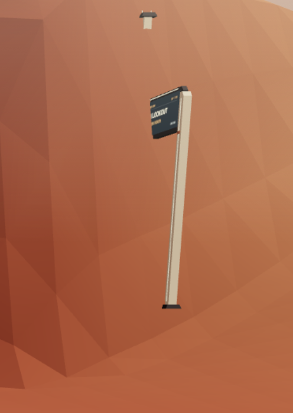
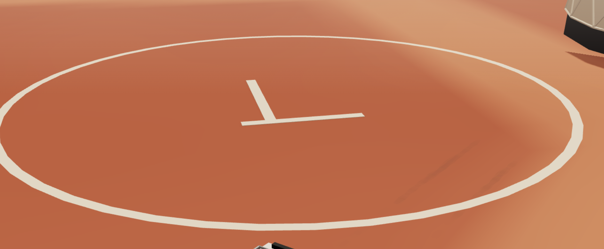

# MArs feedback 2  
  
- The info board next to the crater lookout is placed wrong:   
  
  
- Let’s try to make the haze z bit darker  
  
  
- Small glitch with solar panels: the panel is tilted but the two poles it sits on are the same height. As a result one pole pierces the panel and the other one does not even touch it.  
  
- What does the symbol in the middle of the base mean? A seven?  
-   
