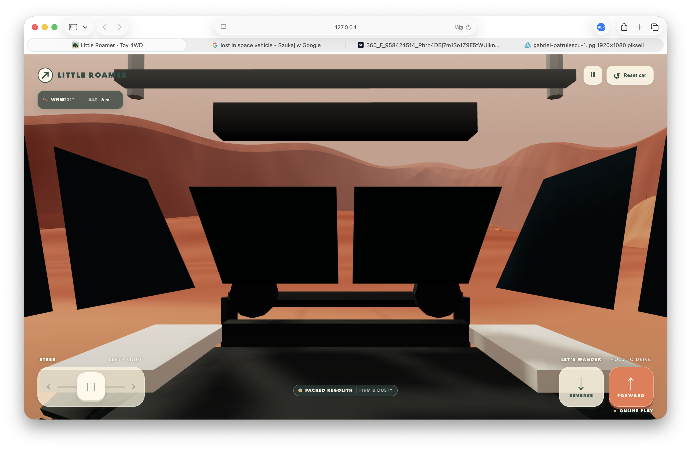
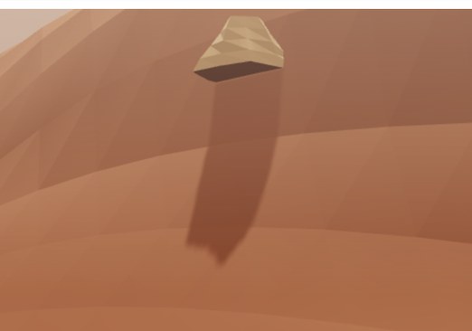
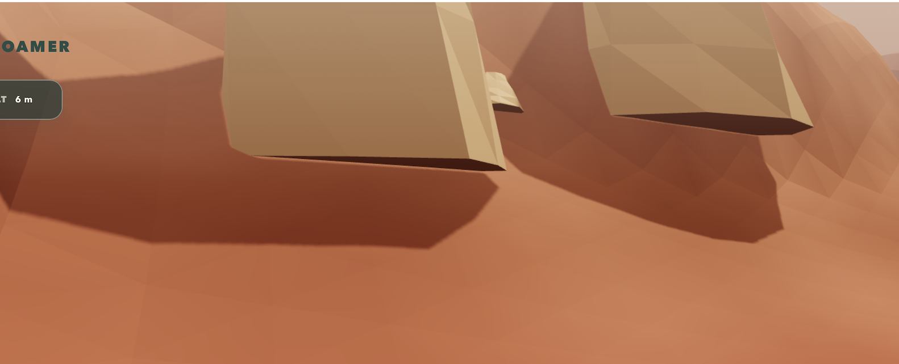
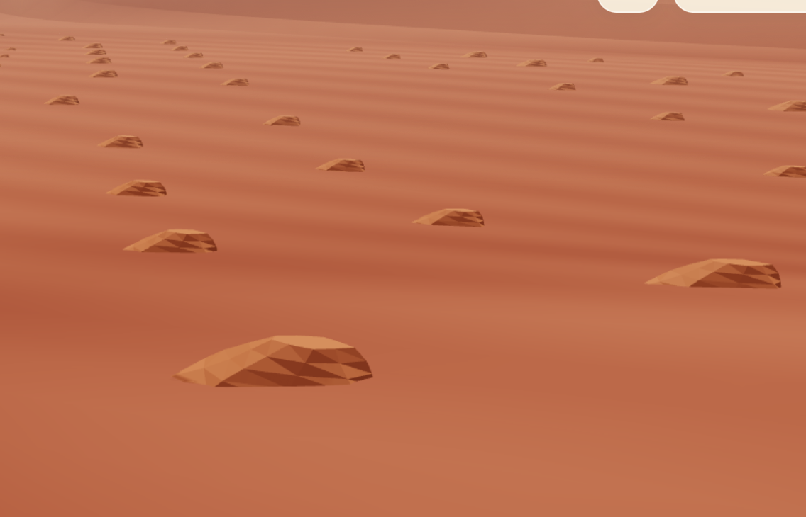
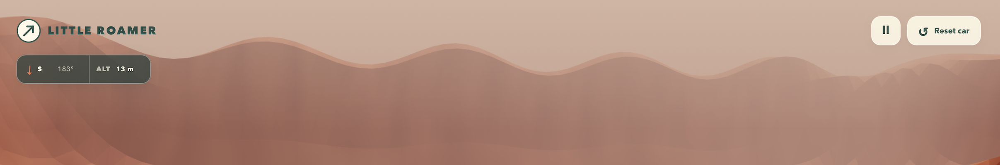
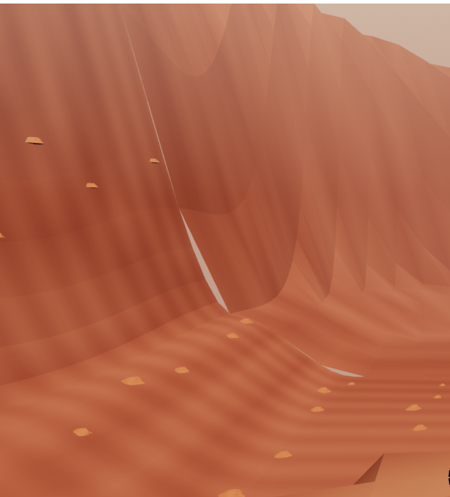

# Mars feedback  
  
Generally it looks cool!   
  
- When the camera is moved because there is something between it and the car then the camera gets inside of the car:  
  
  
- The stones and rocks are partially in the air sometimes:  
  
  
  
  
- The rocks have a nice shape that suggests they are carved by wind in an asymmetric way but sometimes they look just the same:  
  
  
- The outer rim has a not natural wavy form:  
  
  
  
- The whole area seems visually small. Maybe we need more “fog”. How was it done in Northern Reach?  
  
- There are artefacts in the area rim. I think they are on the border of detailed and coarse geometry and move when driving closer / away.  
  
